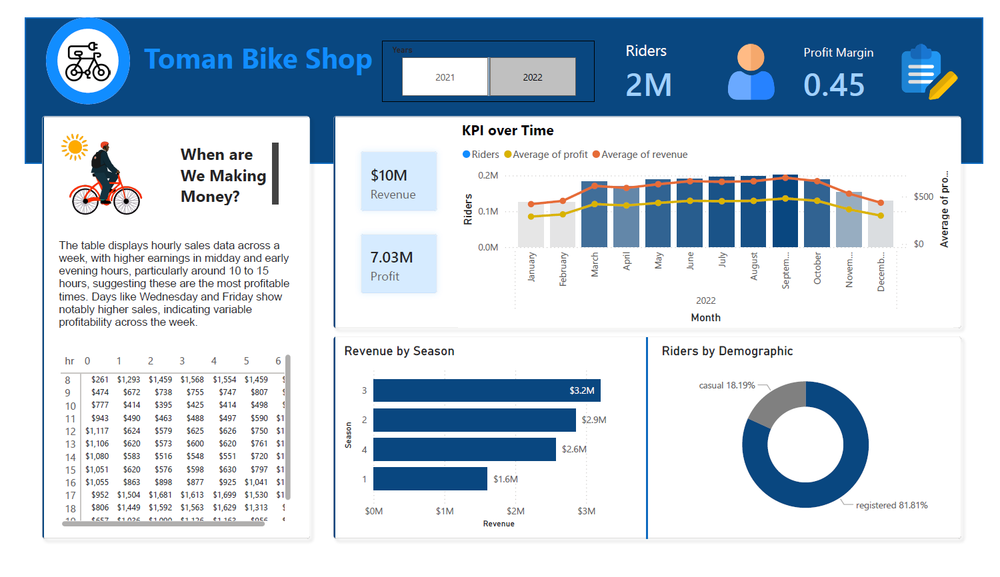

# Recommendation

---

## Anual Report: Toman Bike Shop

| Year      | Total Riders  | Total Revenue      | Total Profit       | Avg Price |
| :-------- | :------------ | :----------------- | :----------------- | :-------- |
| **2021**  | 1,243,103     | $4,959,981.00      | $3,418,533.25      | $3.99     |
| **2022**  | 2,049,576     | $10,227,384.00     | $7,030,045.68      | $4.99     |
| **Total** | **3,292,679** | **$15,187,365.00** | **$10,448,578.93** | **$4.49** |

---

#SQL #PowerBI #DataAnalysis #BikeShopProject

**Conservative Increase:** Considering the substantial increase last year, a more conservative increase
might be prudent to avoid hitting a price ceiling where demand starts to drop. An increase in the range of
10-15% could test the market's response without risking a significant loss of customers.

**Price Setting:**

- If the price in 2022 was $4.99, a 10% increase would make the new price about $5.49.
- A 15% increase would set the price at approximately $5.74.

---

## Recommended Strategy:

**1. Market Analysis:** Conduct further market research to understand customer satisfaction, potential
competitive changes, and the overall economic environment. This can guide whether leaning towards the
lower or higher end of the suggested increase.

**2. Segmented Pricing Strategy:** Consider different pricing for casual versus registered users, as they may
have different price sensitivities.

**3. Monitor and Adjust:** Implement the new prices but be ready to adjust based on immediate customer
feedback and sales data. Monitoring closely will allow you to fine-tune your pricing strategy without
committing fully to a price that might turn out to be too high.
